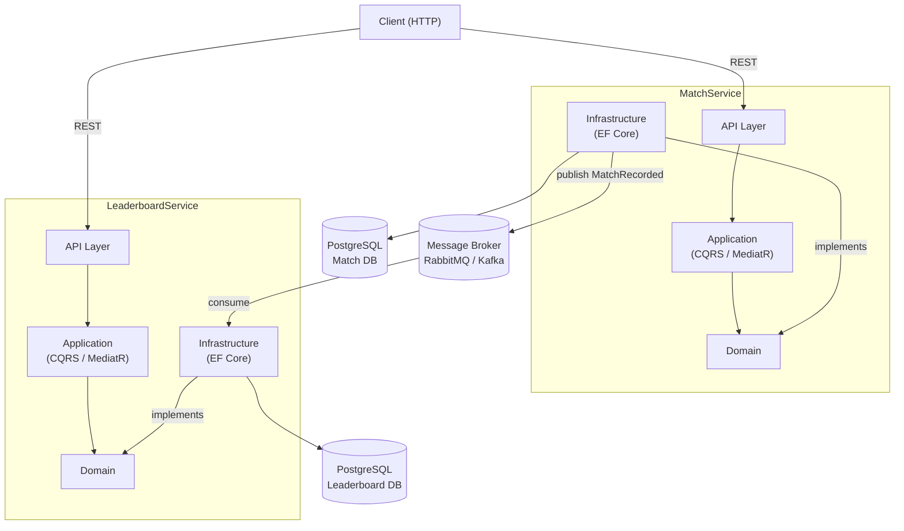
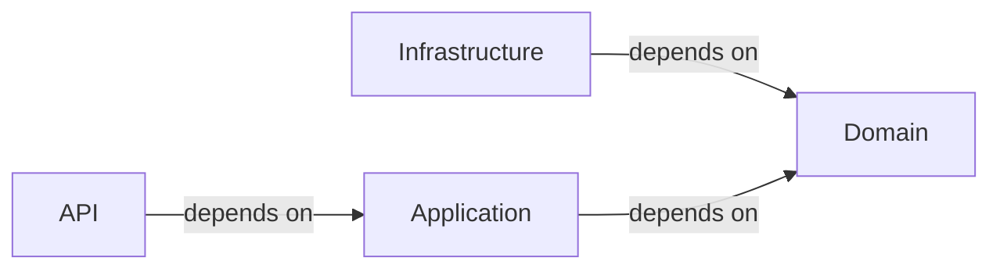
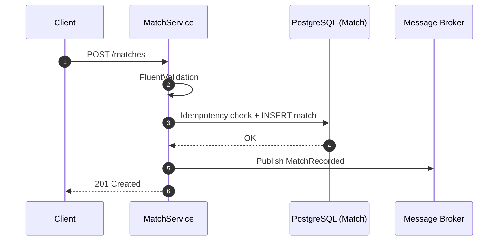
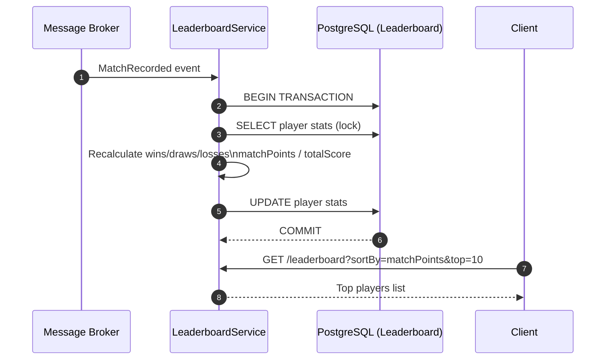
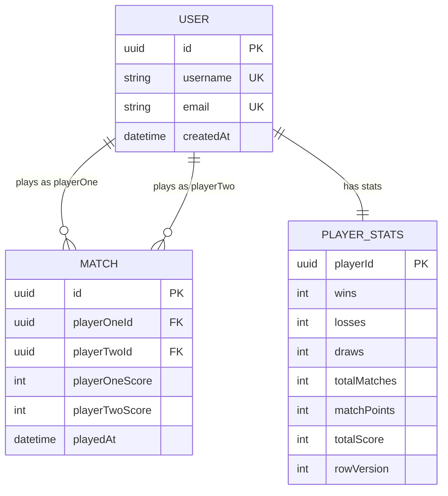

# Диаграммы: RPS Arena API

---

## 1. Общая архитектура системы

---

## 2. Слоистая архитектура (зависимости)

> Domain не зависит ни от чего. Infrastructure и Application зависят от Domain. API зависит от Application.

---

## 3. Запись матча (sequence)

---

## 4. Асинхронный пересчёт лидерборда (sequence)

---

## 5. Модель данных

